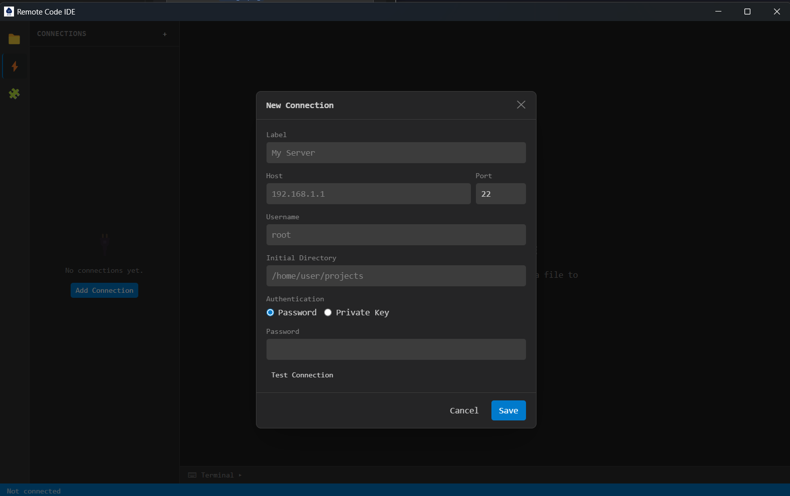
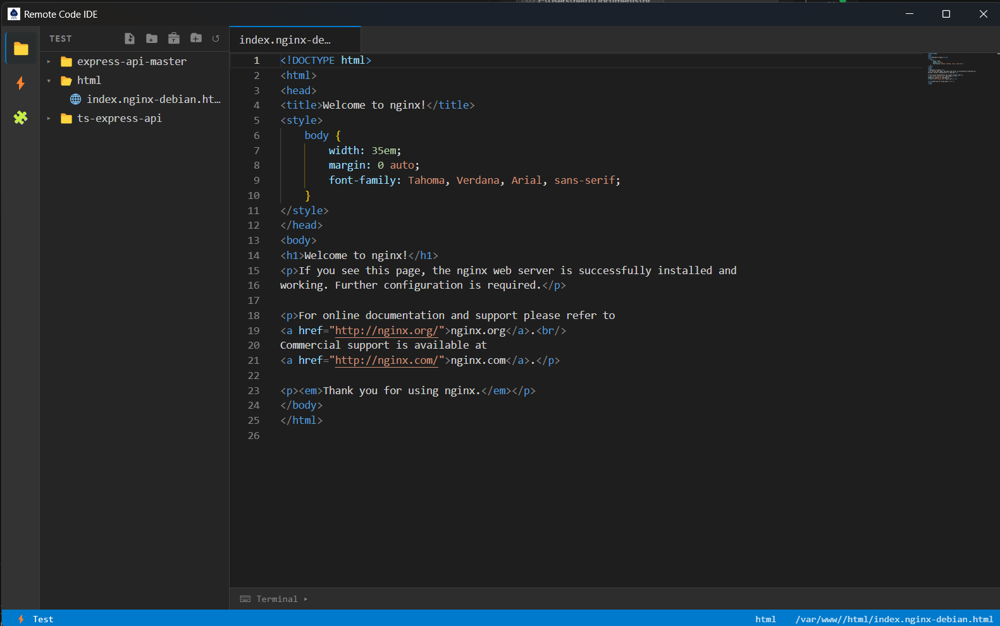

# Remote Code IDE (BETA) 

A desktop remote IDE with SSH/SFTP connections, Monaco editor (VS Code engine), and integrated terminal — similar to Codeanywhere or VS Code Remote SSH, but as a standalone cross-platform Electron app.





## Features

- **SSH connections** with secure credential storage (OS keychain via `safeStorage`)
- **Full file explorer** over SFTP with lazy loading
- **Monaco editor** (VS Code engine) with syntax highlighting for 50+ languages
- **Integrated terminal** (xterm.js) per SSH session
- **Multi-tab editing** with dirty state tracking and auto-save via `Ctrl+S`
- **VSCode extension support** via OpenVSX registry browser
- **File upload/download** with progress tracking (5 MB warning threshold)
- Cross-platform: **Windows**, **macOS**, **Linux**
 
# Contributing

1. Fork and clone the repository
2. Create a feature branch: `git checkout -b feat/my-feature`
3. Make changes and run `npm run typecheck && npm run test:unit`
4. Open a pull request

Please read [CLAUDE.md](CLAUDE.md) for architecture rules and conventions before contributing.

## Prerequisites

| Tool | Version |
|------|---------|
| Node.js | >= 18.x |
| npm | >= 9.x |
| Git | any |

> On Windows, Python and Visual Studio Build Tools are required to compile native modules (`ssh2`).
> Run: `npm install --global windows-build-tools` (as Administrator) or install via the VS Installer.

## Installation

```bash
# 1. Clone the repository
git clone https://github.com/minasvisual/remote-code-ide.git
cd remote-code-ide

# 2. Install dependencies
npm install
```

## Running Locally

```bash
# Start with hot-reload (Electron + Vite)
npm run dev

# Start with DevTools open
npm run dev:console
```

The app window opens automatically. Changes to renderer code reload instantly; changes to main process code restart Electron.

## Building for Production

```bash
# Compile only (outputs to out/)
npm run build

# Windows installer (NSIS)
npm run dist:win

# macOS DMG
npm run dist:mac

# Linux AppImage
npm run dist:linux
```

Distributable packages are written to the `release/` directory.

## Type Checking

```bash
npm run typecheck
```

Runs `tsc --noEmit` on both the main and renderer processes.

## Testing

```bash
# Unit tests (Vitest + React Testing Library)
npm run test:unit

# Unit tests with browser UI
npm run test:ui

# E2E tests (Playwright + Electron) — requires a build first
npm run test:e2e

# E2E with a real SSH server
E2E_SSH_HOST=<host> E2E_SSH_USER=<username> E2E_SSH_PASS=<password> npm run test:e2e

# Run everything
npm test
```

## Project Structure

```
src/
  main/          Node.js/Electron process (SSH, SFTP, storage, IPC)
  preload/       contextBridge — typed API surface exposed to renderer
  renderer/      React 18 UI (Monaco editor, file explorer, terminal)
resources/
  icons/         App icons (ico, png) for all platforms
tests/
  e2e/           Playwright end-to-end tests
```

The codebase follows a strict **Ports & Adapters** (hexagonal) architecture:

```
Domain (entities + interfaces)
  ↑ Use Cases / Application
    ↑ Adapters (ssh2, electron-store, IPC)
      ↑ Infrastructure (Electron entry, IPC registration)
```

## Security

- Credentials are encrypted with the OS keychain (`electron.safeStorage`) — never stored as plaintext
- `contextIsolation: true` and `nodeIntegration: false` are enforced
- Renderer communicates with main only through a typed `window.api` bridge

## License

[MIT](LICENSE) © Ulisses Mantovani
